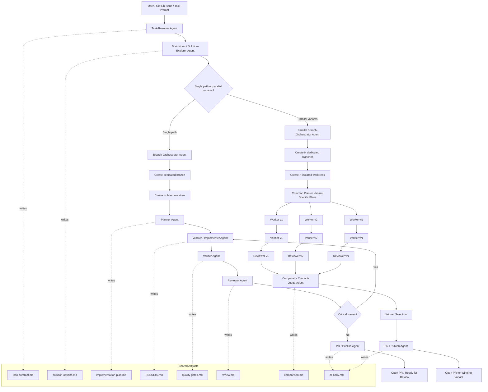

## Role summary

* **Task-Resolver**: turns issue/prompt into a normalized task contract
* **Brainstorm / Solution-Explorer**: decides whether one branch is enough or multiple variants are worth testing
* **Branch-Orchestrator**: owns branch naming, base branch selection, worktree creation, metadata
* **Planner**: produces the implementation plan for a given branch/worktree
* **Worker**: implements and writes `RESULTS.md`
* **Verifier**: runs lint/test/build and writes `quality-gates.md`
* **Reviewer**: checks correctness, scope fit, maintainability, risk
* **Comparator / Variant-Judge**: compares v1..vN and recommends the winner
* **PR / Publish Agent**: prepares PR body and publishes the selected branch

## Core design rule

**Branch lifecycle belongs to the Branch-Orchestrator, not to the Worker.**

## Suggested branch model

* Single implementation:

  * `feature/<name>`
  * `fix/<name>`
  * `refactor/<name>`

* Parallel experiment:

  * `experiment/<feature>-v1`
  * `experiment/<feature>-v2`
  * `experiment/<feature>-v3`

Ha akarod, megcsinálom ennek a **cleaner v2 diagramját** kifejezetten `mannostree` command layerrel együtt.
