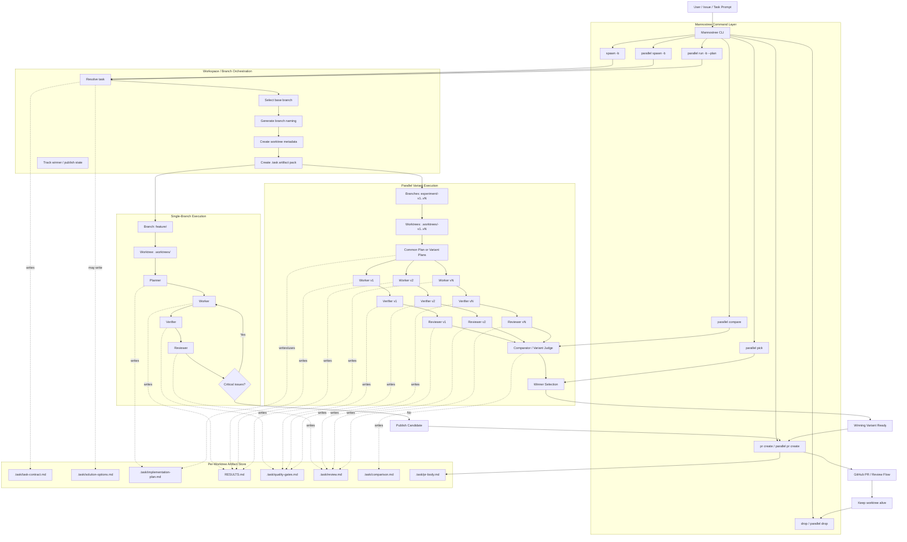

### Key rule

**Branch and worktree lifecycle belong to Mannostree + the Branch-Orchestrator layer, not to the Worker agents.**

### Clean role split

* **CLI**: entrypoint and command UX
* **Orchestration layer**: base branch, naming, metadata, artifact pack
* **Agents**: plan, implement, verify, review, compare
* **Artifact store**: durable handoff/state per worktree
* **GitHub layer**: publish only after selection/review

### Best command story

* Single path: `spawn -> plan -> implement -> verify -> review -> pr create`
* Parallel path: `parallel spawn/run -> compare -> pick -> parallel pr create`

If you want, next I can turn this into a **command tree + module architecture diagram**.
