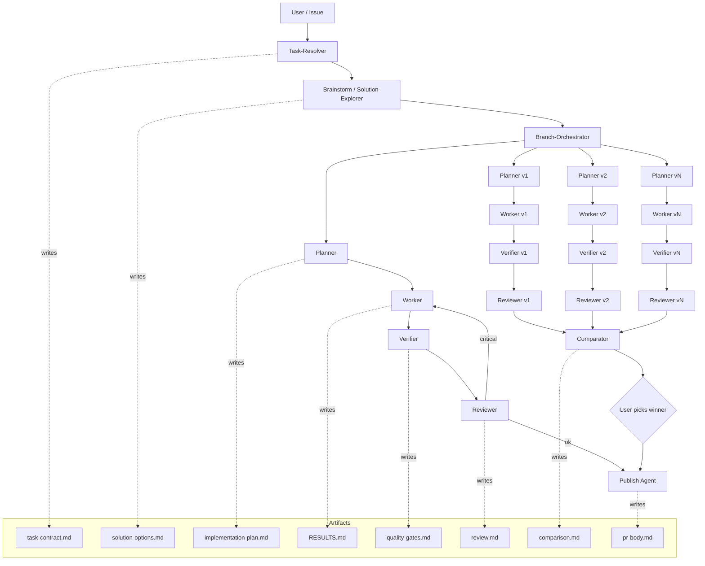

# Agent Architecture

Mannostree is designed so the same lifecycle can be driven by humans, by AI agents, or by a mix. The roles below are **functional contracts**, not specific products. A role may be one prompt, one subprocess, or one human.

## Supervisor vs subagent boundary

| Concern | Supervisor | Subagent |
|---------|------------|----------|
| Branch lifecycle | ✅ | ❌ |
| Base-branch selection | ✅ | ❌ |
| Worktree create / remove | ✅ | ❌ |
| Cleanup approval | ✅ | ❌ |
| Experiment / winner state | ✅ | ❌ |
| Reading task contract | ✅ | ✅ |
| Writing artifacts | ✅ (orchestration ones) | ✅ (within its role) |
| Running tests / build | ❌ (delegates) | ✅ (Verifier) |
| Implementation edits | ❌ | ✅ (Worker only) |

The supervisor is Mannostree itself plus, optionally, an outer agent that calls Mannostree. Subagents always operate **inside an already-prepared worktree** with explicit inputs (artifacts) and produce explicit outputs (artifacts).

## Roles

For each role: **purpose · inputs · outputs · boundaries · forbidden actions**.

### Task-Resolver
- **Purpose.** Convert a raw request (issue, prompt, ticket) into a normalized task contract.
- **Inputs.** Raw issue body, user prompt, optional acceptance criteria.
- **Outputs.** `.task/task-contract.md` (problem, scope, acceptance criteria, out-of-scope, references).
- **Boundaries.** Read-only against the repo.
- **Forbidden.** Modifying code, creating branches, choosing approaches.

### Brainstorm / Solution-Explorer
- **Purpose.** Decide between single-path and parallel-variant execution; sketch options.
- **Inputs.** `task-contract.md`, repo conventions.
- **Outputs.** `.task/solution-options.md` (options with trade-offs, recommended path).
- **Boundaries.** Read-only.
- **Forbidden.** Implementation, branch creation.

### Branch-Orchestrator
- **Purpose.** Owns branch + worktree lifecycle for one or many variants.
- **Inputs.** Resolved task, base branch, kind (single vs parallel), N.
- **Outputs.** Created branches, created worktrees, persisted metadata, scaffolded `.task/`.
- **Boundaries.** No code changes inside worktrees.
- **Forbidden.** Implementation, validation, review, comparison.

### Planner
- **Purpose.** Produce an actionable implementation plan inside a prepared worktree.
- **Inputs.** `task-contract.md`, repo state.
- **Outputs.** `.task/implementation-plan.md` (steps, risks, test plan).
- **Boundaries.** Confined to its worktree.
- **Forbidden.** Source-code edits, branch lifecycle.

### Worker / Implementer
- **Purpose.** Implement the plan and document the outcome.
- **Inputs.** `implementation-plan.md`, repo state in the assigned worktree.
- **Outputs.** Source-code changes; `RESULTS.md`.
- **Boundaries.** Confined to its worktree. Never `git checkout`, never branch creation.
- **Forbidden.** Branch lifecycle, publishing, declaring own work verified.

### Verifier
- **Purpose.** Run mechanical quality gates.
- **Inputs.** Worktree state; profile-defined `validation_commands`.
- **Outputs.** `.task/quality-gates.md` with command-by-command results.
- **Boundaries.** Pure measurement.
- **Forbidden.** Source-code edits, judgments about scope or design.

### Reviewer
- **Purpose.** Judgment-level review (correctness, scope fit, risk, maintainability).
- **Inputs.** Code diff, `task-contract.md`, `implementation-plan.md`, `RESULTS.md`, `quality-gates.md`.
- **Outputs.** `.task/review.md` with critical / major / minor findings and a verdict.
- **Boundaries.** No source edits.
- **Forbidden.** Implementation, publishing.

### Comparator / Variant-Judge
- **Purpose.** Compare N variants and recommend a winner.
- **Inputs.** Per-variant `RESULTS.md`, `quality-gates.md`, `review.md`; metadata summary; optional `--criteria`.
- **Outputs.** `.mannostree/experiments/<feature>/comparison.md` (or `.task/comparison.md` per variant).
- **Boundaries.** Recommendation, not decision. The user (or supervisor) issues `parallel pick`.
- **Forbidden.** Picking the winner, publishing, dropping variants.

### PR / Publish Agent
- **Purpose.** Compose PR body from artifacts; push branch; open PR via host adapter.
- **Inputs.** `RESULTS.md`, `review.md`, `quality-gates.md`, optional `comparison.md`.
- **Outputs.** `.task/pr-body.md`, publish record in metadata, host PR.
- **Boundaries.** Host-specific operations only.
- **Forbidden.** Code edits, merging, branch deletion.

### Cleanup / Archivist (optional)
- **Purpose.** Identify drop/archive candidates; never act without supervisor approval.
- **Inputs.** Registry, metadata, host PR state.
- **Outputs.** Recommendation report; on approval, calls `drop` / `clean`.
- **Forbidden.** Acting unprompted.

## Interaction diagram

## Artifact-first orchestration

- Every role's contract is **read these files, write these files**.
- No role depends on chat memory for correctness.
- A new agent (or human) joining mid-flow can resume from artifacts alone.
- This is what makes the system vendor-neutral and recoverable.
