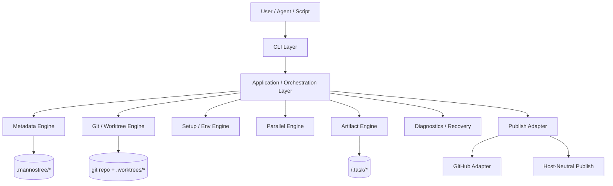
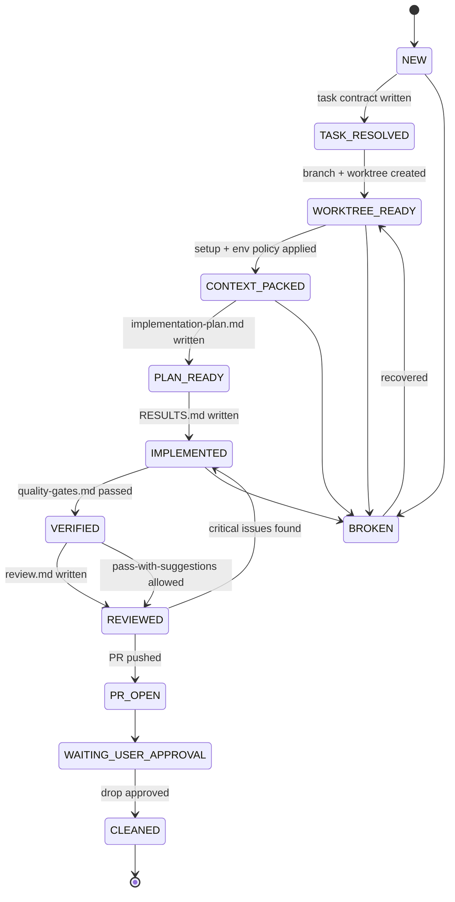
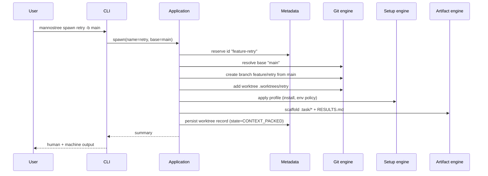

# Architecture

## High-level system view

Mannostree is a layered CLI application. Each layer has a narrow responsibility; cross-layer flow is orchestrated by the Application layer.

## Layers

### 1. CLI layer
- Argument parsing, flag validation, help text, command grouping.
- Output rendering: human (`text`), structured (`--json`, `--yaml`, `--plain`), and verbose (`-v`).
- No business logic; delegates to the Application layer.

### 2. Application / orchestration layer
- Resolves user intent into a typed action.
- Enforces lifecycle rules (allowed state transitions, required artifacts).
- Coordinates Metadata, Git, Setup, Parallel, Artifact, and Publish engines.
- Owns dry-run semantics: every state-changing operation must support a dry-run path.

### 3. Git / worktree engine
- Base-branch resolution, branch creation, worktree create/remove.
- Sync, fetch, ahead/behind, dirty-state detection, conflict detection.
- Diff and status views.
- Pure git operations; never decides lifecycle policy.

### 4. Metadata engine
- Reads and writes `.mannostree/registry.json`, `worktrees/<id>.json`, `experiments/<feature>.json`.
- Atomic file updates (write-then-rename), schema versioning, migration hooks.
- Provides query API (list by state, by tag, by experiment).

### 5. Setup / env engine
- Runs install/setup commands per profile.
- Applies env-file policy: `copy`, `link`, `skip`, `generate`.
- Records setup outcomes into worktree metadata.

### 6. Parallel engine
- Creates and tracks experiment groups.
- Coordinates N variant worktrees + branches.
- Builds comparison summaries from per-worktree metadata + artifacts.
- Owns winner-selection state transitions.

### 7. Artifact engine
- Owns the `.task/` contract: scaffolds files, validates presence/structure, indexes them.
- Generates derived artifacts (e.g., `pr-body.md` from `RESULTS.md` + `review.md`).

### 8. Diagnostics / recovery
- Health checks: does worktree exist on disk? Does branch exist? Is metadata consistent?
- Repair flows for broken or partially-created workspaces.

### 9. Publish adapter
- Host-neutral push + branch tracking.
- Plug-in adapters for GitHub (and future hosts) handle PR creation, review, and project-board updates.

## Lifecycle model (state machine)

State transition rules and per-state owners are defined in [`worktree-lifecycle.md`](worktree-lifecycle.md). Parallel-experiment states are defined in [`parallel-variants.md`](parallel-variants.md).

## Component interaction (single-path spawn)

## ADRs

Each ADR is short and follows: **Context → Decision → Consequences**.

### ADR-001: Mannostree replaces legacy worktree scripts as the single lifecycle layer
**Context.** Many teams already have `worktree-create.sh` / `setup-worktree.sh` scripts that mutate state outside any registry. Two competing lifecycle layers cause drift, duplicated logic, and dangerous cleanup.
**Decision.** Mannostree is the only system permitted to create/remove tracked worktrees and to write `.mannostree/`. Legacy scripts must be deleted or wrapped to call Mannostree.
**Consequences.** Migration effort up-front; afterwards lifecycle becomes deterministic and recoverable. Untracked worktrees are surfaced as broken-state findings by `doctor`.

### ADR-002: Artifact-first orchestration over chat-memory orchestration
**Context.** AI workflows often rely on chat history for plans, results, and reviews. Chat history is ephemeral, vendor-locked, and not auditable.
**Decision.** Every state transition requires (or produces) a durable artifact under `<worktree>/.task/` (or `RESULTS.md` at the worktree root). Agents read and write these files; chat is transient context only.
**Consequences.** Slightly heavier I/O; large gain in reproducibility, multi-agent compatibility, and human auditability. Mannostree can resume work after a fresh session.

### ADR-003: Branch lifecycle belongs to the Branch-Orchestrator
**Context.** When workers (human or AI) own branch creation, naming drifts, base branches get chosen implicitly, and cleanup becomes risky.
**Decision.** Workers operate inside an already-prepared worktree. They never run `git checkout -b`, never select base branches, never create or delete branches.
**Consequences.** Predictable naming and lifecycle; the worker contract becomes narrower and easier to fill with subagents.

### ADR-004: Verification is separate from review
**Context.** Conflating "did the tests pass" with "is this the right change" causes false confidence.
**Decision.** Verifier produces `quality-gates.md` (mechanical: lint/test/build). Reviewer produces `review.md` (judgment: scope, risk, design). Both are required to reach `REVIEWED`.
**Consequences.** Two artifacts instead of one; clearer escalation logic when results disagree.

### ADR-005: Parallel variants are core, not an add-on
**Context.** Multi-variant experimentation is the killer use case for worktrees + AI execution.
**Decision.** Experiment groups, variant naming, comparison, and winner selection are part of the core data model and CLI surface — not an external script.
**Consequences.** More upfront design (experiment record, comparator role, `parallel pick` semantics); but trivial to use and impossible to do safely outside the product.

### ADR-006: GitHub integration must not define the core lifecycle
**Context.** It is tempting to model lifecycle around GitHub PR states. That couples the core to one host and breaks local/private workflows.
**Decision.** Core lifecycle is host-neutral. PR creation, review, and project-board updates live in a dedicated adapter (initially GitHub; future hosts pluggable). Worktrees can complete the full lifecycle without ever pushing.
**Consequences.** Slightly more interface design for the adapter boundary; durable benefit is portability and offline use.

### ADR-007: Metadata uses split files (registry + per-worktree + per-experiment)
**Context.** A single monolithic state file becomes a write-contention point and is fragile to partial corruption.
**Decision.** `registry.json` is a thin discovery index. Truth lives in per-worktree records. Comparison state lives in per-experiment records.
**Consequences.** Multiple files to keep consistent; mitigated by atomic writes and `doctor` consistency checks.

### ADR-008: Two-field status (`status` + `lifecycle_state`)
**Context.** Single-field status overloading produces confusing values like `reviewed_dirty_pr_open`.
**Decision.** `status` is a human-friendly summary; `lifecycle_state` is a normalized machine token from the documented enum.
**Consequences.** Slightly more fields; much cleaner filtering, scripting, and UX.
