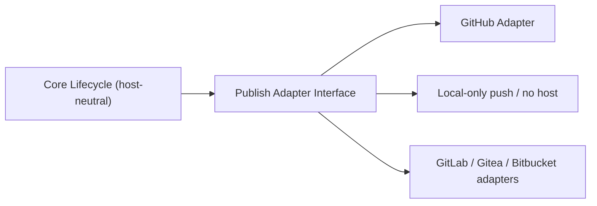

# GitHub Integration

## Position in the architecture

GitHub is an **integration adapter**, not part of the core lifecycle. The core product runs end-to-end without GitHub: spawn, work, validate, review, compare, pick — all host-neutral. Publishing and issue-driven entry points are where the GitHub adapter plugs in.



## What is host-neutral (always works without GitHub)

- Spawn / drop / list / info / status / sync.
- Setup, env, exec.
- Doctor, recover, clean.
- All `.task/` artifact generation.
- Parallel spawn, list, compare, pick.
- Branch and worktree lifecycle management.

## What is GitHub-specific (in the adapter)

- `issue start <issue-ref>`: fetch issue title/body, generate `task-contract.md`.
- `pr create`: push branch, open PR, post body, attach labels.
- `pr view`, `pr checks`: query PR + CI state.
- `parallel pr create`: open PR for the winning variant only.
- Project-board updates (V3+).
- Comments / review summaries (V3+).

## Adapter interface

A minimal interface keeps the core decoupled and future hosts pluggable:

```ts
interface PublishAdapter {
  name: string;
  pushBranch(input: { branch: string; remote: string }): Promise<PushResult>;
  openPullRequest(input: {
    branch: string;
    base: string;
    title: string;
    body: string;
    draft: boolean;
    labels?: string[];
  }): Promise<PullRequestRef>;
  getPullRequest(ref: PullRequestRef): Promise<PullRequestState>;
  getChecks(ref: PullRequestRef): Promise<ChecksSummary>;
}

interface IssueAdapter {
  name: string;
  fetchIssue(ref: string): Promise<{ title: string; body: string; url: string; number: number }>;
}
```

The GitHub adapter implements both. Future adapters (GitLab, Gitea) implement the same interfaces.

## MVP recommendation

- **MVP:** ship a GitHub adapter built on the `gh` CLI. Rationale: zero auth code, follows user's existing config, fast to deliver. Trade-off: shell-out latency, requires `gh` installed.
- **V2:** keep the `gh`-based adapter; add native API path for users without `gh`.
- **V3:** add other host adapters.

## Boundaries (hard rules)

1. **Core never imports GitHub code.** It only sees the adapter interface.
2. **Lifecycle states are host-neutral.** `PR_OPEN` does not imply GitHub; it implies "branch published to a host".
3. **Mannostree never merges.** Merging is the host's UI responsibility.
4. **GitHub failures must not corrupt local state.** Push failures roll back metadata changes; PR creation failures leave the worktree in `REVIEWED` (not `PR_OPEN`).
5. **No `.task/` artifact requires GitHub** to be generated or read.

## PR body composition

The PR body is generated from artifacts (or read from `.task/pr-body.md` if present). Default composition:

```markdown
## Summary
<from RESULTS.md → Summary>

## Changes
<from RESULTS.md → Files changed>

## Validation
<from quality-gates.md>

## Review
<from review.md → Verdict + Critical/Major/Minor counts>

## Comparison (if parallel)
<link to comparison.md or inline winner rationale>

## Notes
<optional from RESULTS.md → Notes>

---
*Generated by Mannostree from .task/ artifacts.*
```

## Configuration

```yaml
integrations:
  github:
    enabled: true
    cli: gh                  # gh | api
    default_remote: origin
    default_draft: true
    label_on_open: ["mannostree"]
    project_board: null      # set to project URL/id when using boards
```

## Why this separation matters

- Teams on **private GitLab / self-hosted Gitea** are first-class users.
- Teams that work **fully offline** can adopt Mannostree with zero host dependency.
- GitHub feature changes do not destabilize the core.
- Adding a new host adapter is a **plugin task**, not a core refactor.
- The artifact contract stays vendor-neutral, which preserves the value of `.task/` even if the chosen host changes.
