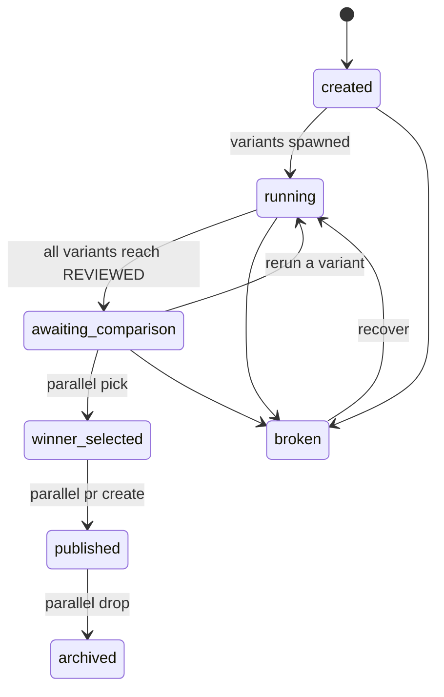

# Parallel Variant Workflows

## Goal

Let a developer (or agent operator) try **N implementations of the same feature** in **isolated worktrees**, compare them against shared criteria, and explicitly pick a winner — without auto-merging anything.

## Experiment model

An **experiment** groups N variant worktrees that share:

- a **feature name** (`retry-api-client`),
- an **explicit base branch**,
- optionally a **shared plan** (`docs/retry-plan.md`),
- a **comparison contract** (criteria + expected RESULTS.md sections).

Each variant has:

- its own branch (`experiment/<feature>-v<i>`),
- its own worktree (`<worktree_root>/<feature>-v<i>`),
- its own `.task/` directory with normal artifacts,
- its own `RESULTS.md` at the worktree root.

## Lifecycle



Per-variant lifecycle is the same as the single-path lifecycle, with one extra terminal-ish state: `ready_for_comparison`.

## Naming

| Object | Pattern |
|--------|---------|
| Branch | `experiment/<feature>-v<i>` |
| Worktree directory | `<worktree_root>/<feature>-v<i>` |
| Worktree id | `experiment-<feature>-v<i>` |
| Experiment record | `.mannostree/experiments/<feature>.json` |

`<i>` starts at 1, increments contiguously, and is fixed at experiment creation. Adding a variant later (`parallel spawn ... 1 --append`) gets the next free index.

## Shared plan vs per-variant plan

- **Shared plan**: one `--plan` file is copied into each variant's `.task/implementation-plan.md`. Best for: comparing implementations of an agreed approach.
- **Per-variant plan**: each variant's planner produces a different plan. Best for: comparing approaches.

Both are supported; the experiment record marks which mode was used.

## Comparison

`mannostree parallel compare <feature>` produces `comparison.md` from:

- per-variant `RESULTS.md` (what changed and why),
- per-variant `quality-gates.md` (validation outcome),
- per-variant `review.md` (judgment),
- cached `summary` block in metadata (files changed, lines added/removed),
- optional user-supplied `--criteria` file (weights or rubric).

## Standard `RESULTS.md` template

Every variant must produce a `RESULTS.md` matching this shape so comparison is mechanical:

```markdown
# RESULTS — <feature> v<i>

## Summary
One paragraph describing the implementation approach.

## Files changed
- path/to/file.ts — purpose
- path/to/other.ts — purpose

## Test evidence
- command: `npm test -- retry`
- outcome: passed (24/24)
- coverage delta: +1.2%

## Trade-offs
- Approach: <X>
- Strengths: ...
- Weaknesses: ...

## Risks
- ...

## Notes for comparator
- ...
```

`mannostree parallel compare` will warn if any required section is missing.

## Example side-by-side comparison output

```markdown
# Comparison — retry-api-client

| Criterion        | v1                         | v2                         | v3                         |
|------------------|----------------------------|----------------------------|----------------------------|
| Approach         | exponential backoff in HTTP layer | retry middleware around fetch | per-route policy with budget |
| Files changed    | 6                          | 8                          | 14                         |
| Lines +/−        | +180 / −12                 | +210 / −34                 | +420 / −90                 |
| Tests            | 18/18 passed               | 24/24 passed               | 31/33 passed (2 flaky)     |
| Lint             | passed                     | passed                     | passed                     |
| Review verdict   | passed                     | passed_with_suggestions    | passed_with_suggestions    |
| Risk             | low                        | low                        | medium (scope creep)       |
| Comparator note  | simplest                   | best balance               | most flexible, costliest   |

## Recommendation
v2 — best balance of correctness, scope, and maintainability.
```

## Winner selection

- `parallel pick` requires comparison to be complete (`comparison.completed=true`) unless `--force`.
- Marks `winner.selected=true` in the experiment record and `parallel.winner=true` on the variant.
- **No merge, no push, no branch deletion** happens at pick time.
- Publishing the winner is an explicit subsequent step (`parallel pr create`).

## Preservation policy

Losing variants are **kept by default**. They survive `parallel pr create`. They are removed only by:

- `parallel drop <feature>` (drops all unless `--keep-winner` / `--keep <id>`),
- `drop <variant-id>` (single variant),
- `clean --stale-days N` policy run.

This is deliberate: a "loser" is often the best fallback if the winner regresses in CI.

## Constraints

- Maximum N per experiment configurable (`parallel.max_variants`, default 5).
- All variants share the same base branch — required for fair comparison.
- All variants must share the same profile (setup + env policy) unless config explicitly allows variant-specific overrides.
