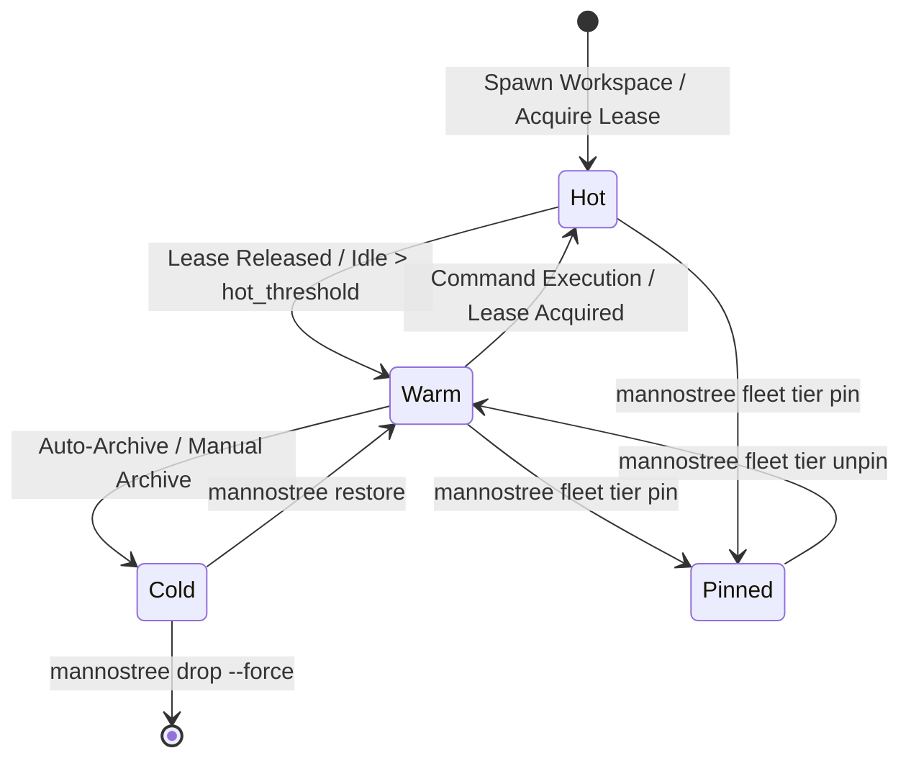

# Data Model: Fleet Tiering, Workspace Leases & Auto-Archive Policy

**Feature**: `005-fleet-tier-auto-archive` (Movement 4)  
**Date**: 2026-09-01  
**Status**: Ready for Planning

---

## 1. Domain Entities & Schemas

### 1.1 WorkspaceLease
Represents an exclusive concurrency lease acquired on a worktree workspace.

```typescript
export interface WorkspaceLease {
  lease_id: string;             // UUID or lease identifier (e.g. lease-wt1-1725184000)
  worktree_id: string;          // Target worktree identifier (e.g. feature-auth-v1)
  holder: string;               // Holder name / agent ID (e.g. agent-runner-01, human-alice)
  purpose: string;              // Declared intent (e.g. "Automated test suite execution")
  acquired_at: string;          // ISO-8601 acquisition timestamp
  expires_at: string;           // ISO-8601 expiration timestamp
  ttl_seconds: number;          // Initial lease duration in seconds
  status: 'active' | 'expired' | 'released';
  renew_count: number;          // Number of times the lease has been renewed
}
```

### 1.2 FleetTier
Classification of workspace lifecycle and resource consumption.

```typescript
export type FleetTier = 'hot' | 'warm' | 'cold' | 'pinned';
```

- **`hot`**: Actively leased or accessed within `hot_threshold_hours`. Mounted in `.worktrees/`.
- **`warm`**: Clean, unleased, idle worktree mounted in `.worktrees/`.
- **`cold`**: Archived worktree. Unmounted from disk, 0 KB working tree footprint, branch and metadata preserved.
- **`pinned`**: Explicitly protected from automatic lifecycle transitions or pruning.

### 1.3 WorktreeRecord Extensions
Extended attributes added to `WorktreeRecord`:

```typescript
export interface WorktreeRecord {
  // Existing fields
  version: number;
  id: string;
  repo_root: string;
  branch: string;
  base_branch: string;
  kind: WorktreeKind;
  profile: string;
  worktree_path: string;
  created_at: string;
  updated_at: string;
  status: 'active' | 'archived' | 'cleaned';
  tags: string[];
  lifecycle_state: WorktreeLifecycleState;

  // New Movement 4 Fields
  pinned?: boolean;             // If true, exempt from auto-archive and auto-tier demotion
  tier?: FleetTier;             // Lifecycle tier
  last_accessed_at?: string;    // ISO timestamp of last execution, sync, or lease
  active_lease_id?: string;     // Reference to active WorkspaceLease if currently held
}
```

### 1.4 FleetPolicyConfig
Declarative fleet resource and retention policies in `mannostree.config.yaml`:

```typescript
export interface FleetPolicyConfig {
  max_active_worktrees?: number;       // Max worktrees mounted concurrently (default: 10)
  idle_ttl_hours?: number;             // Hours of inactivity before eligible for cold archive (default: 48)
  auto_archive_idle?: boolean;         // Enable auto-archiving of idle warm worktrees (default: true)
  auto_archive_completed?: boolean;    // Enable auto-archiving of completed variants (default: false)
  default_lease_ttl_minutes?: number;  // Default lease TTL if unspecified (default: 60)
  hot_threshold_hours?: number;        // Hours since last access to remain hot (default: 4)
  archive_dirty_policy?: 'refuse' | 'stash'; // Behavior on uncommitted changes (default: 'refuse')
}
```

### 1.5 FleetCapacityReport
Dashboard model for fleet resource capacity and tier breakdown:

```typescript
export interface FleetCapacityReport {
  analyzed_at: string;
  max_capacity: number;
  total_worktrees: number;
  active_mounted_count: number;
  hot_count: number;
  warm_count: number;
  cold_count: number;
  pinned_count: number;
  active_leases: WorkspaceLease[];
  archive_candidates: Array<{
    id: string;
    branch: string;
    tier: FleetTier;
    idle_hours: number;
    reason: string;
  }>;
  total_disk_bytes: number;
}
```

### 1.6 AutoArchiveReport
Results of executing an automated archive policy evaluation:

```typescript
export interface AutoArchiveReport {
  timestamp: string;
  dry_run: boolean;
  total_evaluated: number;
  archived_count: number;
  skipped_count: number;
  archived_worktrees: Array<{
    id: string;
    branch: string;
    reason: string;
  }>;
  skipped_worktrees: Array<{
    id: string;
    reason: string;
  }>;
}
```

---

## 2. State Machine & Transitions



---

## 3. Metadata Filesystem Persistence

| Path | Format | Description |
|---|---|---|
| `.mannostree/leases/<worktree_id>.json` | JSON | Active or latest lease record for a worktree |
| `.mannostree/worktrees/<id>.json` | JSON | Worktree metadata with `pinned`, `tier`, `last_accessed_at`, `active_lease_id` |
| `.mannostree/fleet/capacity.json` | JSON | Cached fleet status report |
| `.mannostree/fleet/auto-archive.json` | JSON | Historical record of last auto-archive execution |
