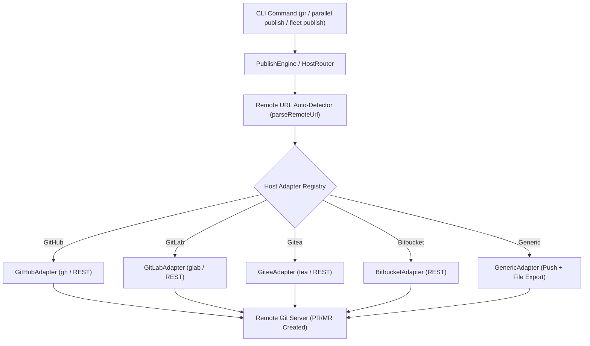

# Implementation Plan: Movement 7 — Multi-Host Adapters

**Feature Directory**: `specs/007-multi-host-adapters`  
**Branch**: `007-multi-host-adapters`  
**Spec Document**: [`specs/007-multi-host-adapters/spec.md`](spec.md)  
**Status**: Ready for Tasks  

---

## 1. Technical Context & Architecture Overview

Mannostree currently manages worktree lifecycles, autonomous agent runs, comparative evaluation matrices, fleet conflict matrices, workspace tiering, and publishing. In Movement 6, pull requests were published primarily through GitHub CLI (`gh`). 

Movement 7 expands this capability into a **pluggable multi-host adapter system** supporting:
- **Auto-Detection**: Zero-config remote URL parser extracting hostname, owner, repo, and host type.
- **Adapters**:
  - `GitHubAdapter` (REST API & `gh` CLI)
  - `GitLabAdapter` (GitLab v4 REST API & `glab` CLI)
  - `GiteaAdapter` (Gitea v1 REST API & `tea` CLI)
  - `BitbucketAdapter` (Bitbucket 2.0 REST API)
  - `GenericAdapter` (Git push + local Markdown export)
- **Host Diagnostics in Doctor**: Audit credentials and CLI tool availability.

---

## 2. Constitution & Safety Invariant Checks

| Principle | Assessment | Status |
| :--- | :--- | :---: |
| **Safety First** | Never force-push to remote base branches without explicit flags. | ✅ PASS |
| **Explicit State** | Record host type, MR/PR number, and remote URL explicitly in metadata records. | ✅ PASS |
| **Reproducibility** | Compiles deterministic PR/MR markdown descriptions and offline fallback files. | ✅ PASS |
| **Credential Safety** | Sensitive API tokens are read from environment variables; NEVER written to metadata. | ✅ PASS |
| **Zero Regressions** | Full backwards compatibility for existing GitHub workflows. | ✅ PASS |

---

## 3. Implementation Phases

### Phase 1: Configuration & Types Setup
- Extend `MannostreeConfigSchema` with `publish.hosts` mapping table (`src/config/schema.ts`).
- Define core types (`HostAdapterType`, `RemoteHostInfo`, `HostPublishOptions`, `HostPublishResult`, `HostHealthStatus`) in `src/types/index.ts`.
- Implement Zod schemas in `src/metadata/schema.ts`.

### Phase 2: Remote URL Parser & Base Adapter Infrastructure
- Implement `parseRemoteUrl` in `src/adapters/detector.ts` supporting HTTPS, SSH, custom ports, and self-hosted domains.
- Implement `HostAdapter` base interface and `AdapterRegistry` in `src/adapters/base.ts`.
- Unit tests for remote URL parsing and auto-detection in `tests/unit/host-detector.test.ts`.

### Phase 3: Concrete Host Adapters
- Implement `GitHubAdapter` in `src/adapters/github.ts`.
- Implement `GitLabAdapter` in `src/adapters/gitlab.ts` (REST API + `glab` CLI).
- Implement `GiteaAdapter` in `src/adapters/gitea.ts` (REST API + `tea` CLI).
- Implement `BitbucketAdapter` in `src/adapters/bitbucket.ts` (REST API 2.0).
- Implement `GenericAdapter` in `src/adapters/generic.ts`.
- Unit tests for each adapter in `tests/unit/host-adapters.test.ts`.

### Phase 4: Integration with Core Engines (`PublishEngine`, `ParallelEngine`, `FleetEngine`, `DoctorEngine`)
- Refactor `PublishEngine.publishPr` and `PublishEngine.batchPublish` to delegate through `AdapterRegistry`.
- Update `ParallelEngine.publishWinner` to use multi-host routing.
- Add host health audits to `DoctorEngine` in `src/core/doctor.ts`.
- Integration tests for multi-host CLI commands in `tests/integration/multi-host-cli.test.ts`.

### Phase 5: Verification & Polish
- Full test suite execution (`npm test`).
- TypeScript strict lint verification (`npm run lint`).
- Update documentation and examples in `README.md`.
