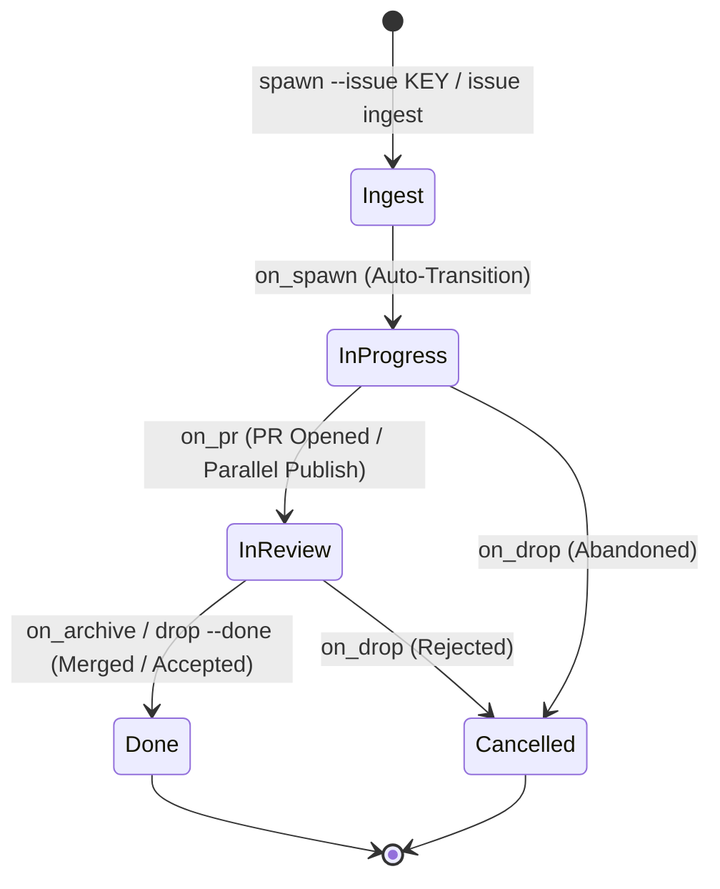

# Data Model & Domain Schema: Movement 10 — Issue Tracker Bi-directional Sync

**Feature Branch**: `010-issue-tracker-sync`  
**Date**: 2026-09-02T11:55:15+02:00  
**Status**: COMPLETE  

---

## 1. Domain Entities & Schemas

### 1. Issue Tracker Provider
```typescript
export type IssueTrackerProvider = 'jira' | 'linear' | 'github' | 'generic';
```

---

### 2. Issue Record (`.mannostree/issues/<KEY>.json`)
Represents a locally cached snapshot of a remote issue ticket.

```typescript
export interface IssueRecord {
  version: number;
  key: string;                       // e.g. "PROJ-123", "ENG-88", "#42"
  provider: IssueTrackerProvider;
  title: string;
  description: string;
  status: string;                    // e.g. "In Progress", "Todo", "Done"
  status_category?: 'todo' | 'in_progress' | 'done' | 'cancelled';
  priority?: string;                 // e.g. "High", "Urgent", "P1"
  assignee?: {
    name: string;
    email?: string;
  };
  labels: string[];
  url: string;
  acceptance_criteria: string[];
  created_at: string;
  updated_at: string;
  last_synced_at: string;
}
```

---

### 3. Worktree Issue Attachment (`WorktreeRecord.task`)
Extended metadata stored in `.mannostree/worktrees/<id>.json`.

```typescript
export interface WorktreeIssueAttachment {
  issue_key: string;
  issue_provider: IssueTrackerProvider;
  issue_url: string;
  issue_title: string;
  issue_status: string;
  last_synced_at: string;
  auto_transition: boolean;
}
```

---

### 4. Issue Configuration Schema (`.mannostree.yml`)
```yaml
issues:
  default_provider: jira # jira | linear | github | generic
  auto_transition: true
  transitions:
    on_spawn: "In Progress"
    on_pr: "In Review"
    on_archive: "Done"
    on_drop: "Cancelled"
  jira:
    host: "https://myorg.atlassian.net"
    project_key: "PROJ"
    api_version: "3"
  linear:
    team_key: "ENG"
  github:
    owner: "organcorp"
    repo: "lsol"
  generic:
    webhook_url: "https://hooks.internal/issues"
```

```typescript
export interface IssueTrackerConfig {
  default_provider?: IssueTrackerProvider;
  auto_transition?: boolean;
  transitions?: {
    on_spawn?: string;
    on_pr?: string;
    on_archive?: string;
    on_drop?: string;
  };
  jira?: {
    host: string;
    project_key?: string;
    api_version?: string;
  };
  linear?: {
    team_key?: string;
  };
  github?: {
    owner?: string;
    repo?: string;
  };
  generic?: {
    webhook_url?: string;
  };
}
```

---

### 5. Issue Transition Result
```typescript
export interface IssueTransitionResult {
  key: string;
  provider: IssueTrackerProvider;
  previous_status: string;
  new_status: string;
  transition_id?: string;
  success: boolean;
  mode: 'transitioned' | 'noop' | 'failed';
  error?: string;
}
```

---

### 6. Issue Comment Result
```typescript
export interface IssueCommentResult {
  key: string;
  provider: IssueTrackerProvider;
  comment_id?: string;
  comment_url?: string;
  success: boolean;
  posted_at: string;
}
```

---

### 7. Issue Drift & Status Summary
```typescript
export interface IssueDriftSummary {
  worktree_id: string;
  worktree_branch: string;
  local_lifecycle_state: string;
  issue_key: string;
  issue_provider: IssueTrackerProvider;
  remote_status: string;
  drift_detected: boolean;
  drift_reason?: string;
}
```

---

### 8. Issue Tracker Health Diagnostic (`DoctorReport`)
```typescript
export interface IssueTrackerHealthStatus {
  provider: IssueTrackerProvider;
  available: boolean;
  token_configured: boolean;
  host_reachable: boolean;
  project_accessible: boolean;
  details?: string;
  error?: string;
}
```

---

## 2. State Transition Lifecycle Matrix


